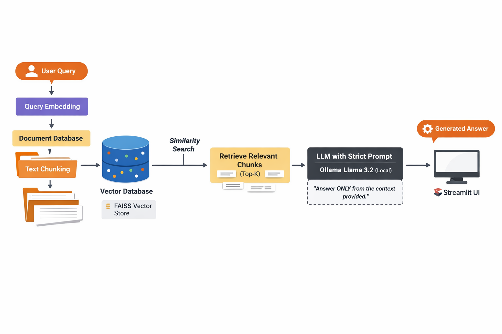

# 🛵 Swiggy RAG — Retrieval-Augmented Generation using FAISS, LangChain & Ollama


---

## 📖 Table of Contents
- [Overview](#-overview)
- [RAG Architecture Diagram](#-rag-architecture-diagram)
- [Project Structure](#-project-structure)
- [Technical Workflow](#-technical-workflow)
- [What is RAG?](#-what-is-rag)
- [Hallucination Control Strategy](#-hallucination-control-strategy)
- [Use Cases](#-use-cases)
- [Requirements](#-requirements)
- [How to Run](#-how-to-run)
- [Example Queries](#-example-queries)
- [Future Enhancements](#-future-enhancements)
- [Source](#-source)
- [Author](#-author)

---

## 🚀 Overview

**Swiggy RAG** is a **Retrieval-Augmented Generation (RAG)** based Question Answering system I built using **Swiggy's Annual Report (FY 2023–24)**.

Unlike traditional LLM-based QA systems, this project ensures that answers come strictly from the provided document, minimizing hallucinations and keeping all your data completely private. No information is sent to external APIs, everything runs locally on your machine using **Ollama (Llama 3.2)** with an interactive **Streamlit** interface.

This project demonstrates a **privacy-first, production-style RAG pipeline** that's perfect for enterprise and confidential documents.

---

## 🧩 RAG Architecture Diagram

The diagram below shows how user queries are processed, how relevant document chunks are retrieved using FAISS, and how grounded answers are generated using a **local LLM**.

```text
data/
└── swiggy_rag_architecture.png
```

---

## 🗂️ Project Structure

```
swiggy_rag/
├── ingest.py          # PDF loading, chunking, embedding, store in FAISS
├── query.py           # Load FAISS DB and build RAG chain
├── app.py             # Streamlit UI
├── requirements.txt   # Python dependencies
├── README.md          # Project documentation
├── swiggy_annual_report_fy2024-25.pdf  # Source document
└── swiggy_rag_index/  # FAISS vector index
```

---

## ⚙️ Technical Workflow

Here's how everything works under the hood:

### 1. Document Ingestion (`ingest.py`)
- Loads the Swiggy Annual Report PDF
- Cleans and splits text into smaller semantic chunks
- Smaller chunk sizes improve retrieval accuracy

### 2. Embedding & Storage
- Text chunks are converted into vector embeddings
- Embeddings are stored in FAISS for lightning-fast similarity search

### 3. Query Processing (`query.py`)
- Your query is embedded into the same vector space
- FAISS retrieves the top-K most relevant chunks
- Retrieved context is passed to the LLM

### 4. Local Answer Generation
- Ollama (Llama 3.2) generates responses based on the context
- A strict prompt enforces context-only answering to prevent hallucinations

### 5. User Interface (`app.py`)
- Clean and simple Streamlit UI for interactive querying
- Easy-to-use experience for anyone

---

## 🧠 What is RAG?

**Retrieval-Augmented Generation (RAG)** is a hybrid approach that combines two powerful concepts:

- **Retrieval** → Fetching relevant document chunks from your data
- **Generation** → Producing answers using an LLM

Instead of relying only on what the model learned during training, RAG grounds responses in real, user-provided data.

**RAG = Retrieval + Generation**

### 🔹 Advantages

- Reduces hallucinations significantly
- Improves factual accuracy
- Works on private datasets without retraining
- No need to fine-tune or retrain the LLM

---

## 🛡️ Hallucination Control Strategy

I've implemented several strategies to actively minimize hallucinations:

- **Using a strict system prompt**: "Answer ONLY from the provided context. If the information is not present, say it's not available."
- **Reducing chunk sizes** for more precise retrieval
- **Disabling internet or external knowledge access**
- **Providing a clear fallback response**: 

> ❗ Information not available in the provided dataset.

---

## 💼 Use Cases

This RAG system is perfect for:

- 🏢 Enterprise document QA (financial reports, policies, handbooks)
- 📊 Annual report analysis and insights
- 🧾 Internal knowledge assistants for organizations
- ⚖️ Legal or financial document querying
- 🔒 Privacy-sensitive RAG applications where data can't leave your infrastructure

---

## 🔧 Requirements

- **Python**: 3.9 or higher
- **Ollama**: Installed and running locally

### Required Libraries

```
langchain
faiss-cpu
streamlit
ollama
pypdf
numpy
```

### Installation

Install all dependencies with:

```bash
pip install -r requirements.txt
```

---

## 🏃‍♂️ How to Run

### Step 1: Install & Run Ollama

```bash
ollama pull llama3.2
```

Make sure Ollama is running locally on your machine.

### Step 2: Ingest the Document

```bash
python ingest.py
```

This step will:
- Load the PDF
- Split text into chunks
- Generate embeddings
- Store vectors in FAISS

### Step 3: Run the Application

**Option A: Streamlit UI (Recommended)**

```bash
streamlit run app.py
```

**Option B: CLI Mode**

```bash
python query.py
```

---

## 🧪 Example Queries

Try asking questions like:

- Who is the CEO of Swiggy?
- What were Swiggy's key financial highlights for FY 2023–24?
- Explain Swiggy's business model.
- What risks are mentioned in the annual report?

If the answer isn't found in the document, the system will respond gracefully instead of making things up.

---

## 🚀 Future Enhancements

I'm planning to add these features in upcoming versions:

- Source citation for answers (showing which page/section the answer came from)
- Multi-document ingestion support
- Hybrid retrieval (combining BM25 + Vector Search)
- Retrieval evaluation metrics for quality assurance
- Dockerized deployment for easier setup
- FastAPI backend for production use

---

## 📄 Source

This project uses **Swiggy's Annual Report FY 2023–24** (publicly available document).

---

## 👨‍💻 Author

**Ayush Mishra**  
AI / ML Enthusiast  
Focused on RAG Systems, LLMs, and Applied NLP

> "Grounding language models with real data — one document at a time."

---

## 📝 License

This project is open source and available for educational and personal use.

---

**⭐ If you found this project helpful, please consider giving it a star on GitHub!**